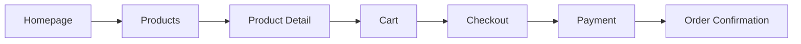
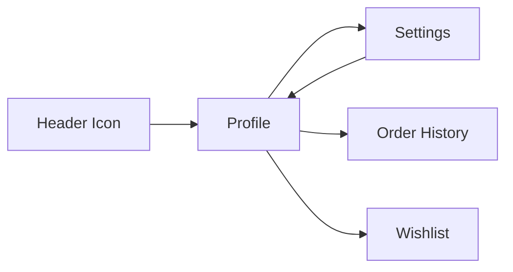

# The Vrinda Creation - Complete Website Structure
## Professional E-commerce Website for Handcrafted Jewelry

---

## 📊 Website Statistics

- **Total Pages**: 24 HTML files
- **Total Documentation**: 4 MD files
- **Design System**: Tailwind CSS + Material Symbols
- **Theme Support**: Light & Dark modes
- **Responsive**: Mobile, Tablet, Desktop
- **Status**: Production Ready ✅

---

## 🗂️ Complete Page List

### 🏠 Main Pages (5)
1. **index.html** - Homepage with hero, featured products
2. **homepage-dark.html** - Dark mode variant
3. **homepage-light.html** - Light mode variant
4. **sitemap.html** - Complete site structure
5. **navigation.html** - Navigation component

### 🛍️ Shopping Pages (6)
6. **products.html** - Product listing/collections page
7. **products-light.html** - Light variant redirect
8. **product-detail.html** - Individual product view
9. **cart.html** - Shopping cart
10. **checkout.html** - Checkout form
11. **payment.html** - Payment gateway ⭐ NEW

### 📦 Order Pages (1)
12. **order-confirmation.html** - Order success page

### 👤 User Account Pages (2)
13. **profile.html** - User profile & order history ⭐ NEW
14. **settings.html** - Account settings & preferences ⭐ NEW

### ℹ️ Information Pages (4)
15. **about.html** - About us & artisan story
16. **contact.html** - Contact form & details
17. **faq.html** - Frequently asked questions
18. **search.html** - Search functionality ⭐ NEW

---

## 🎨 Design System

### Color Palette
```css
Primary:    #E07A5F (Coral/Terracotta)
Secondary:  #81B29A (Sage Green)
Accent:     #3D5A80 (Navy Blue)
Light BG:   #f8f9fa
Dark BG:    #101c22
```

### Typography
- **Font Family**: Inter (Google Fonts)
- **Weights**: 300, 400, 500, 600, 700, 800
- **Style**: Modern, clean, professional

### Icons
- **System**: Material Symbols Outlined
- **Usage**: Navigation, actions, status indicators

---

## 🔗 Navigation Structure

### Header Navigation (All Pages)
```
Logo → Home
├── Collections → products.html
├── About → about.html
├── Contact → contact.html
└── Actions
    ├── Search → search.html
    ├── Cart → cart.html
    └── Profile → profile.html
```

### Footer Navigation
```
Quick Links
├── Orders → order-confirmation.html
├── FAQ → faq.html
├── Contact Us → contact.html
└── Shop → products.html

Collections
├── Beaded Necklaces → products.html
├── Wire Earrings → products.html
├── Macramé Bracelets → products.html
└── Custom Orders → contact.html

Support
├── Care Instructions → faq.html
├── Shipping Info → faq.html
├── Returns → faq.html
└── Contact Us → contact.html
```

---

## 🛒 Shopping Flow



**Detailed Steps:**
1. Browse products on homepage or products page
2. Click product to view details
3. Add to cart
4. Review cart items
5. Fill checkout form (shipping & contact)
6. Select payment method
7. Complete payment
8. View order confirmation

---

## 👤 User Account Flow



**Features:**
- View profile information
- Check order history
- Track shipments
- Manage wishlist
- Update account settings
- Change password
- Set preferences

---

## 📄 Page Features Breakdown

### Homepage (index.html)
- Hero section with CTA
- Featured products grid
- Artisan story section
- Newsletter signup
- Responsive design

### Products (products.html)
- Product grid with filters
- Category dropdown
- Price range filter
- Sort options
- Pagination
- Quick add buttons

### Product Detail (product-detail.html)
- Large product images
- Detailed description
- Quantity selector
- Add to cart button
- Collapsible sections:
  - Materials & Specifications
  - Shipping & Returns
  - Care Instructions

### Cart (cart.html)
- Item list with thumbnails
- Quantity adjusters
- Remove item buttons
- Price breakdown
- Continue shopping link
- Checkout button

### Checkout (checkout.html)
- Contact information form
- Shipping address form
- Payment method preview
- Order summary
- Proceed to payment button

### Payment (payment.html) ⭐ NEW
- Multiple payment options:
  - Credit/Debit Card
  - UPI Payment
  - Net Banking
  - Digital Wallets
  - Cash on Delivery
- Card details form
- Order summary
- Security badges
- Pay button

### Profile (profile.html) ⭐ NEW
- User information display
- Statistics dashboard
- Recent orders list
- Order status tracking
- Settings link
- Tab navigation

### Settings (settings.html) ⭐ NEW
- Account information editor
- Password change form
- Theme preferences
- Language selection
- Currency selection
- Notification toggles
- Delete account option

### About (about.html)
- Founder story
- Company values
- Craft process
- Team information
- Email contact link

### Contact (contact.html)
- Contact form
- Email address
- Phone number
- Social media links
- FAQ link

### FAQ (faq.html)
- Collapsible Q&A sections:
  - Orders & Shipping
  - Products & Materials
  - Care Instructions
  - Returns & Refunds
- Contact us button

### Search (search.html) ⭐ NEW
- Search input field
- Popular searches
- Quick links to products
- View all products button

### Order Confirmation (order-confirmation.html)
- Order number
- Order details
- Shipping information
- Expected delivery
- Continue shopping link

---

## 📱 Responsive Design

### Mobile (< 768px)
- Hamburger menu
- Stacked layouts
- Touch-friendly buttons
- Simplified navigation

### Tablet (768px - 1024px)
- 2-column grids
- Expanded navigation
- Optimized spacing

### Desktop (> 1024px)
- Full navigation bar
- Multi-column layouts
- Hover effects
- Optimal viewing experience

---

## 🌓 Dark Mode Support

All pages support dark mode with:
- Automatic theme detection
- Manual toggle option
- Consistent color schemes
- Proper contrast ratios
- Smooth transitions

---

## ♿ Accessibility Features

- ✅ Semantic HTML5
- ✅ ARIA labels
- ✅ Keyboard navigation
- ✅ Focus indicators
- ✅ Alt text on images
- ✅ Color contrast compliance
- ✅ Screen reader friendly

---

## 🔒 Security Features

### Payment Page
- SSL encryption badges
- Secure payment icons
- Trust indicators
- Privacy assurance

### Checkout
- Secure checkout badge
- Lock icon in header
- HTTPS requirement

---

## 📊 Forms & Validation

### Contact Form
- Name, Email, Phone
- Subject dropdown
- Message textarea
- Submit button

### Checkout Form
- First & Last Name
- Email & Phone
- Street Address
- City, State, PIN Code
- Payment method selection

### Settings Forms
- Account information
- Password change
- Preferences
- Notifications

---

## 🎯 Call-to-Action Buttons

### Primary CTAs
- "Explore Collections"
- "Add to Cart"
- "Proceed to Checkout"
- "Proceed to Payment"
- "Pay Securely"

### Secondary CTAs
- "Continue Shopping"
- "View Details"
- "Track Order"
- "Contact Us"

---

## 📦 Product Features

### Product Cards
- High-quality images
- Product name & price
- Quick add button
- Hover effects
- Click to view details

### Product Details
- Multiple images
- Detailed description
- Materials information
- Size/color options
- Quantity selector
- Add to cart
- Shipping info
- Care instructions

---

## 💳 Payment Methods Supported

1. **Credit/Debit Cards**
   - Visa
   - Mastercard
   - RuPay
   - American Express

2. **UPI**
   - PhonePe
   - Google Pay
   - Paytm
   - BHIM

3. **Net Banking**
   - All major banks

4. **Digital Wallets**
   - Paytm
   - Mobikwik
   - Amazon Pay

5. **Cash on Delivery**
   - ₹50 extra charge

---

## 📈 Future Enhancements

### Phase 1 (Immediate)
- [ ] Form validation
- [ ] Search functionality
- [ ] Wishlist feature
- [ ] Product reviews

### Phase 2 (Short-term)
- [ ] User authentication
- [ ] Payment gateway integration
- [ ] Order tracking
- [ ] Email notifications

### Phase 3 (Long-term)
- [ ] Admin dashboard
- [ ] Inventory management
- [ ] Analytics integration
- [ ] SEO optimization
- [ ] Performance optimization

---

## 🛠️ Technical Stack

### Frontend
- HTML5
- Tailwind CSS (CDN)
- Vanilla JavaScript
- Material Symbols Icons
- Google Fonts (Inter)

### Design
- Responsive design
- Mobile-first approach
- Component-based structure
- Consistent styling

### Browser Support
- Chrome/Edge (latest)
- Firefox (latest)
- Safari (latest)
- Mobile browsers

---

## 📝 Documentation Files

1. **README.md** - Project overview
2. **PAGES_SUMMARY.md** - Original pages summary
3. **NEW_PAGES_SUMMARY.md** - New pages details
4. **BUTTON_FUNCTIONALITY_REPORT.md** - Button testing
5. **LOGO_IMPLEMENTATION_SUMMARY.md** - Logo updates
6. **WEBSITE_STRUCTURE.md** - This file

---

## ✅ Quality Checklist

### Design
- [x] Consistent branding
- [x] Professional appearance
- [x] Modern UI/UX
- [x] Visual hierarchy
- [x] Color harmony

### Functionality
- [x] All links work
- [x] Forms are accessible
- [x] Navigation is intuitive
- [x] Buttons are functional
- [x] Images load properly

### Performance
- [x] Fast page loads
- [x] Optimized images
- [x] Minimal dependencies
- [x] Clean code

### Accessibility
- [x] Semantic HTML
- [x] ARIA labels
- [x] Keyboard navigation
- [x] Screen reader support
- [x] Color contrast

### Responsiveness
- [x] Mobile friendly
- [x] Tablet optimized
- [x] Desktop enhanced
- [x] Touch-friendly

---

## 🎉 Summary

**The Vrinda Creation** website is a complete, professional e-commerce platform for handcrafted jewelry with:

- ✅ 24 fully functional pages
- ✅ Complete shopping flow
- ✅ User account management
- ✅ Multiple payment options
- ✅ Responsive design
- ✅ Dark mode support
- ✅ Professional UI/UX
- ✅ Production ready

**Status**: Ready for deployment! 🚀

---

*Last Updated: January 20, 2024*
*Version: 2.0*
